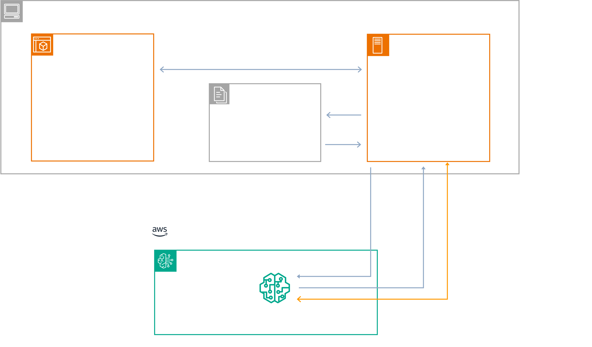

# Kiro Steering Studio

This solution provides a voice-powered interface for generating [Kiro](https://kiro.dev) steering files using [Amazon Nova 2 Sonic](https://docs.aws.amazon.com/nova/latest/userguide/speech.html). Steering files are configuration documents that give Kiro persistent knowledge about your workspace. Instead of manually writing markdown files, you can have a natural conversation with an AI assistant that understands your project requirements and generates properly structured steering files in real-time. The application uses bidirectional audio streaming with Amazon Bedrock and provides immediate visual feedback as files are created and refined.

## Architecture

The application consists of a Node.js backend server that manages WebSocket connections and streams audio to Amazon Nova 2 Sonic, paired with a browser-based frontend for voice capture and real-time display of generated steering files.



### Key Components

- **NovaSonicClient**: Manages bidirectional streaming with Amazon Bedrock, handling audio input/output and tool calling
- **SteeringStore**: Maintains in-memory state of steering files with atomic file writes and session recovery
- **SessionManager**: Tracks Socket.IO session state including audio readiness and keepalive timers
- **Tool System**: Zod-validated tools for AI-controlled steering file updates

### Project Structure

```
src/
├── index.ts              # Application entry point
├── config/
│   └── index.ts          # Centralized configuration
├── server/
│   ├── types.ts          # Server type definitions
│   └── session-manager.ts # Socket session state management
├── sonic/
│   ├── client.ts         # Nova Sonic streaming client
│   └── types.ts          # Sonic type definitions
└── steering/
    ├── store.ts          # Steering file state management
    ├── tools.ts          # AI tool definitions and handlers
    └── types.ts          # Steering type definitions

public/
├── index.html            # Web UI
├── main.js               # Client-side application
├── style.css             # Styles
└── lib/
    ├── AudioPlayer.js    # Audio playback handler
    └── AudioPlayerProcessor.worklet.js
```

## Deployment

### Prerequisites

Before deploying the solution, ensure you have the following:

- Node.js 20.x or later
- AWS account with Amazon Bedrock access enabled
- Access to the Nova Sonic model (`amazon.nova-2-sonic-v1:0`) in your AWS region
- AWS credentials configured (via AWS CLI, environment variables, or IAM role)

### Steps

1. Clone the repository:

   ```bash
   git clone https://github.com/aws-samples/kiro-steering-studio.git
   cd kiro-steering-studio
   ```

2. Install dependencies:

   ```bash
   npm install
   ```

   > **Note**: For CI/CD pipelines or production deployments, use `npm ci` instead to ensure reproducible builds from `package-lock.json`.

3. Create a `.env` file in the project root (see `.env.example` for reference):

   | Variable | Description | Example |
   | --- | --- | --- |
   | AWS_REGION | AWS region for Bedrock | us-east-1 |
   | AWS_PROFILE | Optional AWS credentials profile | default |
   | MODEL_ID | Nova Sonic model identifier | amazon.nova-2-sonic-v1:0 |
   | STEERING_DIR | Output directory for steering files | ./.kiro/steering |
   | PORT | Server port | 3000 |

4. Start the development server:

   ```bash
   npm run dev
   ```

5. Open http://localhost:3000 in your browser.

6. Use the voice interface:
   - Click the microphone button to start recording
   - Describe your project—its purpose, target users, technical requirements
   - The AI will ask clarifying questions and update steering files in real-time
   - Click stop when finished; files are saved to your configured steering directory

### Clean Up

To stop the application, press `Ctrl+C` in the terminal where the server is running. Generated steering files remain in the configured `STEERING_DIR` directory and can be deleted manually if no longer needed.

### Session State

The application persists conversation state to enable session recovery. State is stored in a `state.json` file located adjacent to the steering directory (e.g., `.kiro/steering-studio/state.json`):

```json
{
  "version": 1,
  "updatedAt": "2025-01-26T18:30:00.000Z",
  "product": {
    "appOneLiner": "A task management app for remote teams",
    "targetUsers": "Distributed engineering teams"
  },
  "tech": {
    "frontend": "React with TypeScript",
    "backend": "Node.js with Express"
  },
  "structure": {
    "repoLayout": ["src/", "public/", "tests/"]
  },
  "openQuestions": []
}
```

This file is automatically loaded when the server starts, allowing you to resume where you left off. To start fresh, delete the `state.json` file before starting the server.

## Steering Files

Steering gives Kiro persistent knowledge about your workspace through markdown files. Instead of explaining your conventions in every chat, steering files ensure Kiro consistently follows your established patterns, libraries, and standards. Out of the box, Kiro provides foundational steering files to establish core project context.

For more information, see [Steering](https://kiro.dev/docs/steering/).

### product.md

Defines what you're building:
- Application one-liner
- Target users
- MVP user journeys and features
- Non-goals (out of scope)
- Success metrics
- Domain glossary

### tech.md

Defines how to build it:
- Frontend stack
- Backend approach
- Authentication
- Data storage
- Infrastructure as Code
- Observability
- Styling guide

### structure.md

Defines project organization:
- Repository layout
- Naming conventions
- Import patterns
- Architecture patterns
- Testing approach

## Limitations

- **Browser Requirements**: Requires a modern browser with Web Audio API support (Chrome, Firefox, Edge, Safari).
- **Region Availability**: Amazon Nova 2 Sonic is available in select AWS regions; verify availability in your target region.
- **Audio Format**: Input audio must be PCM format at 16kHz sample rate.
- **Session Duration**: Long sessions may require reconnection due to WebSocket timeouts. Reconnection is automatically initialized using a session JSON file.
- **Concurrent Sessions**: Each browser tab creates a separate session with Amazon Bedrock

## Security

See [CONTRIBUTING](CONTRIBUTING.md#security-issue-notifications) for more information.

## License

This library is licensed under the MIT-0 License. See the LICENSE file.
